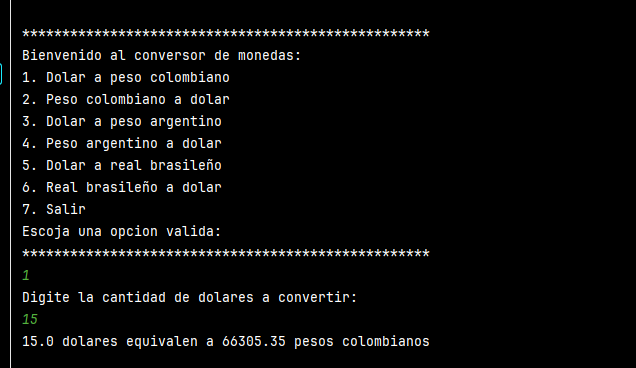

# Conversor de Monedas

Este proyecto en Java permite realizar conversiones entre varias monedas. El usuario puede seleccionar una opción en el menú para convertir entre dólares estadounidenses y pesos colombianos, pesos argentinos o reales brasileños y viceversa.

## Menú de Opciones

Al ejecutar el programa, se despliega el siguiente menú:

1. **Dólar a peso colombiano**
2. **Peso colombiano a dólar**
3. **Dólar a peso argentino**
4. **Peso argentino a dólar**
5. **Dólar a real brasileño**
6. **Real brasileño a dólar**
7. **Salir**

## Instrucciones para Ejecutar

1. Abre el proyecto en IntelliJ IDEA.
2. Ejecuta el archivo `Main.java`.
3. El menú de opciones se desplegará en la consola.
4. Ingresa el número correspondiente a la conversión que deseas realizar.
5. Escribe la cantidad a convertir cuando se te solicite.
6. Recibirás el resultado de la conversión en la misma consola.

## Requerimientos

- **Java 8 o superior**
- **IntelliJ IDEA** u otro entorno de desarrollo compatible.

## Vista del Programa

